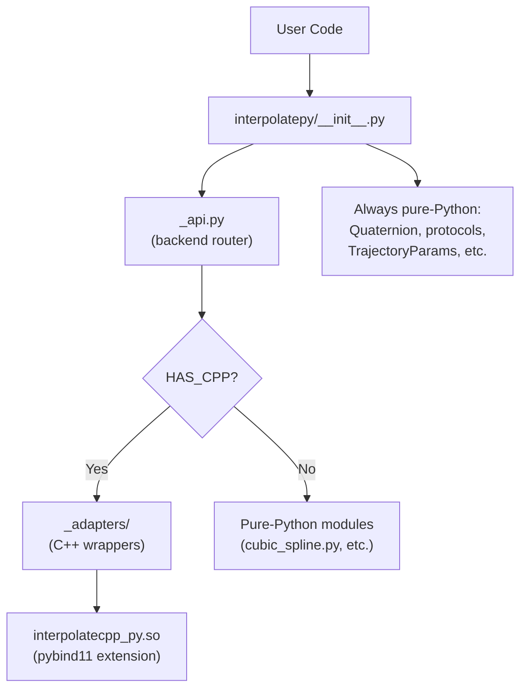

# Architecture

InterpolatePy uses a **dual-backend architecture**: a compiled C++ extension for performance-critical workloads, with an automatic pure-Python fallback when the extension is unavailable.

## Overview



## Backend Detection

The module `_backend.py` handles backend detection at import time:

1. Checks for the `INTERPOLATEPY_NO_CPP` environment variable
2. If not set, attempts to import the compiled extension `interpolatecpp_py`
3. Sets `HAS_CPP = True` on success, `False` on `ImportError`

```python
import interpolatepy
print(f"C++ backend active: {interpolatepy.HAS_CPP}")
```

To force pure-Python mode:
```bash
export INTERPOLATEPY_NO_CPP=1
```

## Import Routing

`_api.py` uses `HAS_CPP` to decide where each symbol comes from:

| `HAS_CPP` | Import source | Example |
|-----------|--------------|---------|
| `True` | `_adapters._spline.CubicSpline` | C++ core + Python `plot()` |
| `False` | `cubic_spline.CubicSpline` | Pure Python implementation |

The user-facing API (`__init__.py`) is identical regardless of backend. Code that imports from `interpolatepy` works the same either way.

## Adapter Pattern

Each adapter in `_adapters/` subclasses the pybind11-exposed C++ class and adds Python-only convenience methods:

```
_adapters/
  _spline.py       CubicSpline, CubicSmoothingSpline, ...
  _bspline.py      BSpline, BSplineInterpolator, ...
  _motion.py       DoubleSTrajectory, TrapezoidalTrajectory, ...
  _paths.py        LinearPath, CircularPath
  _quaternion.py   SquadC2, QuaternionSpline, ...
  _direct.py       Direct re-exports (StateParams, TrajectoryBounds, ...)
```

**What adapters add:**

- `plot()` methods (matplotlib visualization)
- `__repr__` for readable string representation
- API normalization (e.g., C++ returns `FullTrajectoryResult` structs, adapters unpack to tuples)

**What stays pure-Python:**

- `Quaternion` class (`quat_core.py`) -- core quaternion math
- Protocol definitions (`protocols.py`) -- structural typing interfaces
- Parameter dataclasses (`TrajectoryParams`, `CalculationParams`, `InterpolationParams`)

## C++ Library Structure

The C++ implementation lives in the `cpp/` directory:

```
cpp/
  include/interpolatecpp/    Header-only public interface
    spline/                  Cubic spline family (5 headers)
    bspline/                 B-spline family (6 headers)
    motion/                  Motion profiles (5 headers)
    path/                    Path primitives (4 headers)
    quat/                    Quaternion interpolation (5 headers)
    concepts.hpp             C++20 concepts for type safety
    tridiagonal.hpp          Shared tridiagonal solver
  src/                       Implementation files (23 .cpp files)
  bindings/                  pybind11 binding definitions
  tests/                     Catch2 unit tests (142 tests)
  examples/                  C++ usage examples (16 programs)
  CMakeLists.txt             Build configuration
```

**Key design choices:**

- **C++20** with concepts for compile-time type checking
- **Eigen 3.4** for linear algebra (fetched automatically via CMake FetchContent)
- **pybind11** for Python bindings (also fetched via FetchContent)
- **Catch2** for C++ unit testing
- **Header-only public interface** with separate compilation units

## Building the C++ Extension

See the [Installation Guide](installation.md#c-backend-optional) for build instructions.

### CMake Options

| Option | Default | Description |
|--------|---------|-------------|
| `INTERPOLATECPP_BUILD_TESTS` | `ON` | Build Catch2 unit tests |
| `INTERPOLATECPP_BUILD_BINDINGS` | `OFF` | Build pybind11 Python bindings |
| `INTERPOLATECPP_BUILD_EXAMPLES` | `OFF` | Build C++ example programs |

## Performance Characteristics

The C++ backend provides the most benefit for:

- **Spline construction** -- solving tridiagonal systems, computing coefficients
- **Batch evaluation** -- evaluating trajectories at many time points
- **Motion profile planning** -- iterative phase calculations in DoubleSTrajectory

The pure-Python backend uses vectorized NumPy operations and remains fast for most use cases. The C++ backend is an optimization, not a requirement.
