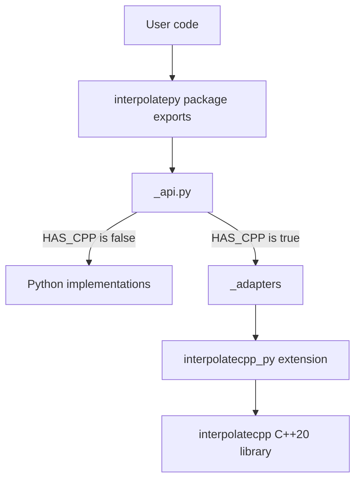

# Architecture

## Overview

InterpolatePy contains three layers:


```mermaid
flowchart TD
    User[User code] --> Public[interpolatepy package exports]
    Public --> Router[_api.py]
    Router -->|HAS_CPP is false| Python[Python implementations]
    Router -->|HAS_CPP is true| Adapters[_adapters]
    Adapters --> Extension[interpolatecpp_py extension]
    Extension --> Library[interpolatecpp C++20 library]
```

Application code should normally use the package root or the grouped
`splines`, `bsplines`, `motion`, `quaternion`, and `paths` namespaces. Both
surfaces are backend-aware. Concrete implementation modules remain importable
for development and debugging, but a direct implementation import bypasses
backend selection.

## Backend detection

`src/interpolatepy/_backend.py` runs once during package import:

1. if `INTERPOLATEPY_NO_CPP` is nonempty, native loading is skipped;
2. otherwise it imports `.interpolatecpp_py` relative to the package;
3. `HAS_CPP` becomes `True` only if that import succeeds;
4. an extension `ImportError` leaves the Python fallback active.

Any nonempty value disables the extension, including the string `"0"`. Set the
variable before Python starts:

```bash
INTERPOLATEPY_NO_CPP=1 python your_program.py
```

An unavailable optional extension is intentionally silent. Call
`get_cpp_module()` only in backend internals; it raises when the extension was
not loaded.

## Public import routing

`src/interpolatepy/__init__.py` exposes version and backend information, imports the
backend-routed algorithms from `_api.py`, and exports the always-Python
`Quaternion`, plotting helper, configuration classes, and runtime-checkable
protocols.

`_api.py` has two explicit branches. This makes the resolved class stable for
the life of the process and avoids conditional checks in every evaluation. The
domain package initializers resolve their public names lazily through the same
router, so grouped and package-root imports always select the same backend.

The top-level export list in `interpolatepy.__all__` is the compatibility
boundary. New public APIs must be wired through:

1. the Python implementation;
2. the C++ binding and adapter when a native equivalent exists;
3. both branches of `_api.py`;
4. `src/interpolatepy/__init__.py` and its `__all__` list;
5. tests and the API reference.

## Adapter layer

The pybind11 classes are fast but do not always present Python-native input and
output behavior. Files under `src/interpolatepy/_adapters/` handle differences such
as:

- accepting lists and NumPy arrays consistently;
- vectorizing scalar C++ evaluators over NumPy arrays;
- converting native quaternions back to the Python `Quaternion` class;
- preserving Python parameter data classes;
- adding plotting and batch path helpers;
- providing aliases for differently named native properties.

Use the package root for the backend-neutral workflows shown in the quick
start. Some implementation-specific helpers are Python-only. In particular,
the current native logarithmic-quaternion bindings do not expose
`generate_trajectory()`, `get_physical_kinematics()`, or acceleration boundary
arguments, and some B-spline refinement/diagnostic helpers exist only in the
Python implementation. Use `INTERPOLATEPY_NO_CPP=1` if an application depends
on those helpers.

## Source layout

```text
src/interpolatepy/
  __init__.py             public namespace
  _backend.py             extension detection
  _api.py                 backend routing
  _adapters/              Python-facing native wrappers
  splines/                scalar spline algorithms
  bsplines/               parametric B-spline algorithms
  motion/                 motion profiles and polynomials
  quaternion/             rotation primitives and interpolation
  paths/                  geometric paths and moving frames
  visualization/          optional Matplotlib integrations

cpp/
  include/interpolatecpp/ public C++ headers
  src/                    C++ implementations
  bindings/               pybind11 module
  tests/                  Catch2 tests
  examples/               C++ example programs

tests/                    Python tests
examples/                 Python example programs
docs/                     MkDocs sources
```

Public algorithm modules keep the user-facing classes and delegate focused
numerical work to private helpers such as B-spline system builders,
parameterization strategies, and the Double-S phase planner. Native motion
adapters likewise live one profile per module. This keeps the compatibility
surface easy to find without concentrating unrelated solver, plotting, and
backend code in a few large files.

## C++ targets

The CMake project requires C++20 and creates the `interpolatecpp` library. The
`interpolatecpp_py` module links that library. scikit-build-core installs it
inside the Python package, and cibuildwheel produces tested platform wheels.

| CMake option | Default |
| --- | --- |
| `INTERPOLATECPP_BUILD_TESTS` | `ON` |
| `INTERPOLATECPP_BUILD_BINDINGS` | `OFF` |
| `INTERPOLATECPP_BUILD_EXAMPLES` | `OFF` |

CMake FetchContent pins Eigen 3.4.0, Catch2 3.7.1, and pybind11 2.13.6 for the
targets that need them. See [Installation](installation.md#optional-c-backend)
for build commands.

## Testing the two implementations

The main Python suite exercises the selected public backend and also imports
some implementation modules directly for focused unit coverage. To guarantee a
fallback-only run:

```bash
INTERPOLATEPY_NO_CPP=1 uv run pytest
```

After copying a built extension into `src/interpolatepy/`, start a new process and
run the same suite without the variable. C++ implementation tests are discovered
by CTest from `cpp/tests/`.

Backend parity tests should compare observable results and documented errors,
not private coefficients or implementation-specific object identity.
